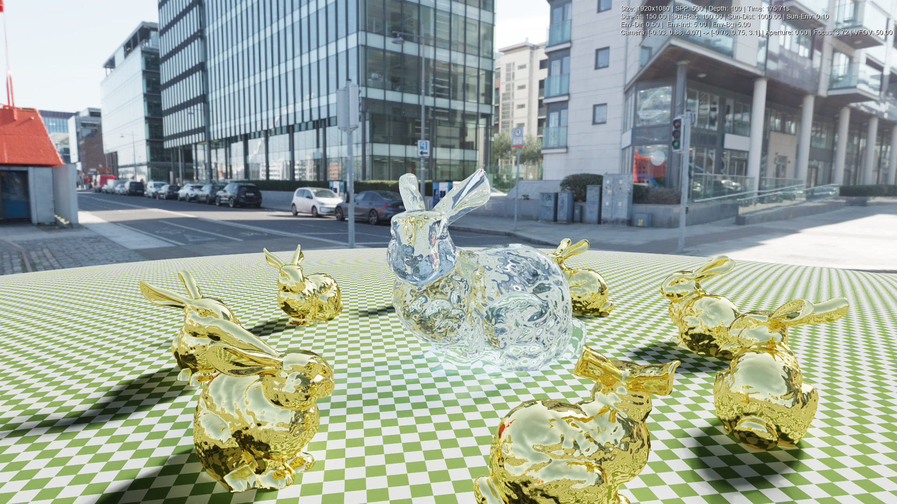

# Python + C++ Path Tracer (Nanobind)

A high-performance path tracer combining the ease of use of Python (scene definition, window management) with the raw power of C++ (rendering core, BVH traversal). This project serves as a testbed for advanced rendering techniques and hybrid architecture.

## 🖼️ Gallery


*Typical output showing global illumination and material properties*

| | | |
|:---:|:---:|:---:|
|  |  |  |

## ✨ Features

*   **Hybrid Architecture**: seamless integration between Python (Logic/UI) and C++ (Compute) using [nanobind](https://github.com/wjakob/nanobind).
*   **Physically Based Rendering**:
    *   **Materials**: Glass with customizable IOR/Tint, Rough Metals, Plastic with Clearcoat, Lambertian.
    *   **Lighting**: HDR Environment Maps, Emissive materials, "Fake" Caustics (transparent shadows).
    *   **Camera**: Depth of Field (Focus Distance & Aperture).
*   **Interactive Editor**: Real-time preview with "Fly" camera controls and object inspection.
*   **Denoising**: Fully automated integration of **Intel Open Image Denoise (OIDN)**.
*   **Animation**: Automated turntable video generation.

## 🚀 Installation

The project is managed by `uv`, which handles Python dependencies, the virtual environment, and even drives the C++ compilation.

### Prerequisites
*   **Python 3.10+**
*   **uv** (Universal Python Package Manager)
*   **C++ Compiler** (Visual Studio MSVC on Windows, Clang/GCC on Linux/Mac)
*   **CMake**

### Setup
Run the setup script which will download assets (HDRs, 3D models), download OIDN, and compile the C++ extension:

```bash
uv run setup_project.py
```

## 🎮 Interactive Editor

Launch the editor to explore scenes, compose shots, and tweak focus.

```bash
uv run main.py --editor --scene showcase
```


### Controls

| Context | Input | Action |
| :--- | :--- | :--- |
| **Movement** | `W`, `A`, `S`, `D` | Move Camera (Forward/Left/Back/Right) |
| | `Q`, `E` | Move Up / Down |
| | `Mouse Right` (Hold) | Look Around (Pan/Tilt) |
| | `Mouse Wheel` | Zoom (Move Forward/Back) |
| **Focus** | `F` (Hold) or `Click Focus` UI | **Pick Focus Point**: Click anywhere in the 3D view to auto-set focus distance |
| **Objects** | `Click Left` | Select instance (Gizmo appears) |
| **System** | `ESC` | Cancel selection / Exit |

> [!TIP]
> **Picking Focus**: This is a key feature. Instead of guessing distances, simply hold `F` and click on the object you want to be sharp. The Depth of Field will update instantly.

## 📸 Rendering & Usage

All orchestration is done via `main.py`.

### 1. High-Quality Render
Once you have your camera coordinates (from the editor's console output) or using default scene cameras:

```bash
uv run main.py --scene showcase --width 1280 --height 720 --spp 200 --depth 50
```
*   `--spp`: Samples Per Pixel. Higher is cleaner but slower.
*   `--depth`: Max light bounces.
*   `--auto-sun`: Enables a procedural sun light.

### 2. Animation (Turntable)
Generate a 360° video around the scene center.

```bash
uv run main.py --scene random --animate --frames 120 --fps 30
```
The script renders all frames to `outputs/frames/` and uses FFMPEG (via imageio) to compile `outputs/videos/animation.mp4`.

## 📂 Project Structure

*   `src/`: **C++ Engine**. Contains the logic for Rays, Spheres, Triangles (BVH), and Materials.
*   `modes/`:
    *   `editor/`: The Pygame-based interactive viewer logic.
    *   `renderer.py`: The offline rendering loop with tiling and OIDN post-processing.
*   `scenes.py`: Defines the 3D scenes (Cornell Box, Random Spheres, Custom Mesh scenes).
*   `assets/`: Downloaded models (OBJ) and textures.
