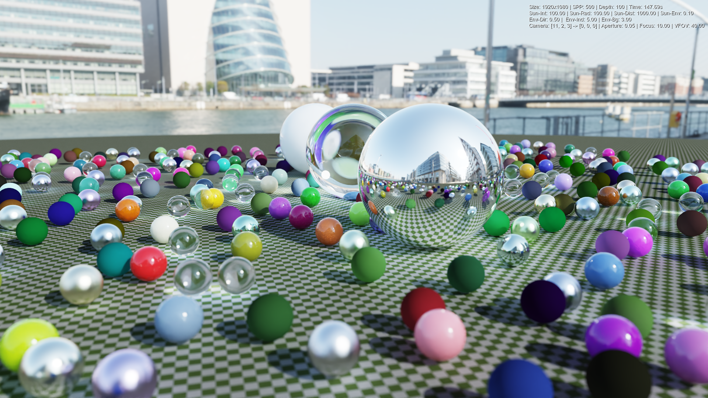
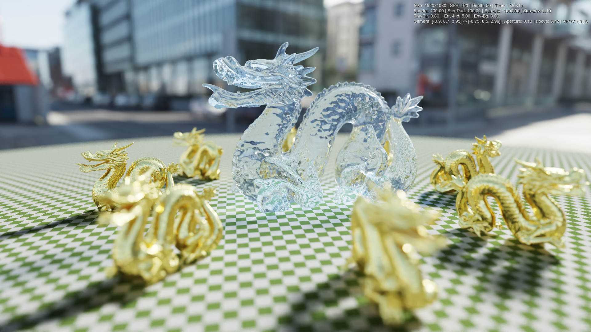
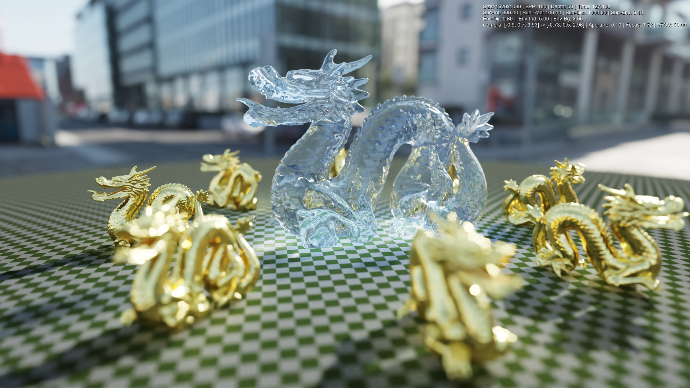

# Python + C++ Path Tracer (Nanobind)

A high-performance path tracer combining the ease of use of Python (scene definition, window management) with the raw power of C++ (rendering core, BVH traversal). This project serves as a testbed for advanced rendering techniques and hybrid architecture.

## 🖼️ Gallery


*Typical output showing global illumination and material properties*

| | | |
|:---:|:---:|:---:|
|  |  |  |

## ✨ Features

*   **Hybrid Architecture**: seamless integration between Python (Logic/UI) and C++ (Compute) using [nanobind](https://github.com/wjakob/nanobind).
*   **Physically Based Rendering**:
    *   **Materials**: Glass with customizable IOR/Tint, Rough Metals, Plastic with Clearcoat, Lambertian.
    *   **Lighting**: HDR Environment Maps, Emissive materials, "Fake" Caustics (transparent shadows).
    *   **Camera**: Depth of Field (Focus Distance & Aperture).
*   **Interactive Editor**: Real-time preview with "Fly" camera controls and object inspection.
*   **Denoising**: Fully automated integration of **Intel Open Image Denoise (OIDN)**.
*   **Animation**: Automated turntable video generation.

## 🚀 Installation

The project is managed by `uv`, which handles Python dependencies, the virtual environment, and even drives the C++ compilation.

### Prerequisites
*   **Operating System**: Windows 10/11, macOS (Intel/M1+), or Linux (x64).
*   **C++ Compiler**:
    *   **Windows**: Visual Studio 2019+ (with C++ Desktop Development workload).
    *   **Mac**: Xcode or Command Line Tools (`xcode-select --install`).
    *   **Linux**: `build-essential`.

### One-Click Setup (Bootstrap)
We provide bootstrap scripts that automatically check for `uv`, install it if missing, and run the project setup.

**Windows**:
Double-click `setup.bat` or run in terminal:
```cmd
.\setup.bat
```

**Mac / Linux**:
```bash
./setup.sh
```

These scripts will:
1.  Check/Install `uv`.
2.  Download Assets (HDRIs, Models).
3.  Download and Configure OIDN (matching your platform).
4.  Compile the C++ Engine (optimized for your CPU).

## 🎮 Interactive Editor

Launch the editor via `uv` (or reopen the terminal if `uv` was just installed):

```bash
uv run main.py --editor --scene showcase
```


*Main editor interface with "Live Raw Raytracing" preview mode*

| | | |
|:---:|:---:|:---:|
|  |  |  |

### Controls

| Context | Input | Action |
| :--- | :--- | :--- |
| **Movement** | `Arrows` | Move Camera (Forward/Left/Back/Right) |
| | `PageUp`, `PageDn` | Move Up / Down |
| | `Mouse Middle` (Hold) | Drag Up / Down (Elevation) |
| | `Mouse Right` (Hold) | Look Around (Pan/Tilt) |
| | `Mouse Wheel` | Zoom (Move Forward/Back) |
| **Focus** | `F` (Hold) or `Click Focus` UI | **Pick Focus Point**: Click anywhere in the 3D view to auto-set focus distance |
| **Objects** | `Click Left` | Select instance (Gizmo appears) |
| **System** | `ESC` | Cancel selection / Exit |

> [!TIP]
> **Picking Focus**: This is a key feature. Instead of guessing distances, simply hold `F` and click on the object you want to be sharp. The Depth of Field will update instantly.

## 📸 Rendering & Usage

All orchestration is done via `main.py`.

### 1. High-Quality Render
Once you have your camera coordinates (from the editor's console output) or using default scene cameras:

```bash
uv run main.py --scene showcase --width 1280 --height 720 --spp 200 --depth 50
```
*   `--spp`: Samples Per Pixel. Higher is cleaner but slower.
*   `--depth`: Max light bounces.
*   `--auto-sun`: Enables a procedural sun light.

### 2. Animation (Turntable)
Generate a 360° video around the scene center.

```bash
uv run main.py --scene random --animate --frames 120 --fps 30
```
The script renders all frames to `outputs/frames/` and uses FFMPEG (via imageio) to compile `outputs/videos/animation.mp4`.

## 📂 Project Structure

*   **Root**:
    *   `main.py`: Entry point for CLI and Editor.
    *   `loader.py`: Orchestrates scene loading and C++ engine population.
    *   `scenes.py`: Declarative definitions of 3D scenes.
    *   `config.py`: Configuration classes (RenderConfig).
    *   `setup_project.py`: Installation & Compilation script.
    *   `meshloader.py`: Trimesh loading wizardry (GLB/OBJ -> Buffers).
    *   `transforms.py`: Math helpers for matrices.
    *   `denoise.py`: OIDN wrapper.

*   `src/`: **C++ Engine Core** (Nanobind)
    *   `main.cpp`: Python bindings and Scene Management.
    *   `renderer.h`: Path Tracing loop (ray_color), NEE, MIS.
    *   `materials.h`: BSDF implementations (Metal, Plastic, Glass).
    *   `geometry.h`: Primitives (Sphere, Quad, Triangle).
    *   `bvh.h`: Bounding Volume Hierarchy implementation.
    *   `hittable.h`: Abstract base class for objects.
    *   `instance.h`: Instancing logic (Geometry + Transform).
    *   `camera.h`: Camera model (DoF, FOV).
    *   `common.h`: Math utilities, Constants, RNG.
    *   `environment.h`: HDRI loading and Importance Sampling.

*   `modes/`: **Application Logic**
    *   `editor/`: **Interactive Mode** (PyGame)
        *   `main.py`: Event loop and rendering orchestration.
        *   `state.py`: Source of Truth (Camera, Selection, History).
        *   `ui_core.py`: Custom Immediate-Mode UI widgets.
        *   `panels/`: UI layout definitions.
    *   `renderer.py`: **Offline Mode** (Tiled Rendering, OIDN, Video).

*   `docs/`: **Documentation** (Architecture, Roadmap, Guidelines).
*   `assets/`: External resources (Textures, Models, HDRIs).
*   `outputs/`: Generated artifacts (Renders, Videos, Frame sequences).
    *   `scenecache/`: Temporary BVH caches for faster loading.

## 📚 Documentation
For more details on the internals and future plans:
*   [Architecture](./docs/architecture.md): Deep dive into the Hybrid Python/C++ design and data flow.
*   [Future Roadmap](./docs/future_roadmap.md): Strategic plan including PBR improvements (GGX, MIS) and stability fixes.
*   [UI Design System](./docs/ui_design_system.md): Overview of the custom ImGui-like widget system.
