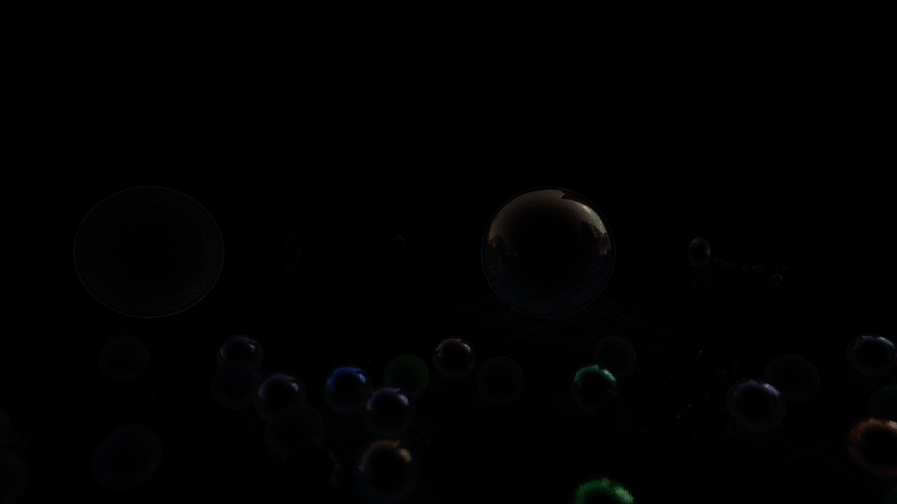

# Raytracing Benchmark Report

## 1. Performance (Micro-Benchmark)

| Metric | Reference | Previous | Current | Diff vs Ref | Diff vs Prev |
|---|---|---|---|---|---|
| Average Time (s) | 9.336226433360329 | 9.377886133268476 | **9.468** | +1.42% | +0.97% |
| Mrays / s | 9.476376845774109 | 9.434279617251473 | **9.34** | -1.40% | -0.96% |

## 2. Quality Rendering (Macro-Benchmark)

- **Resolution:** 3840x2160

### Rendering Performance

| Metric | Reference | Previous | Current | Diff vs Ref | Diff vs Prev |
|---|---|---|---|---|---|
| Render Time (s) | 113.829 | 112.899 | **113.693** | -0.12% | +0.70% |

### Visual Differences

| Comparison | MSE | Diff Pixels (%) |
|---|---|---|
| **Current vs Reference** | 0.34850001335144043 | 1.1823% |
| **Current vs Previous** | 0.34850001335144043 | 1.1823% |

### Images

#### Current Render (RAW)

#### Zoom: Reference (Left) vs Current (Right)

#### Difference Map (Ref vs Cur)

#### Zoom: Previous (Left) vs Current (Right)

#### Difference Map (Prec vs Cur)

